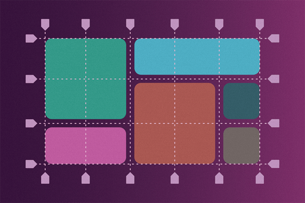
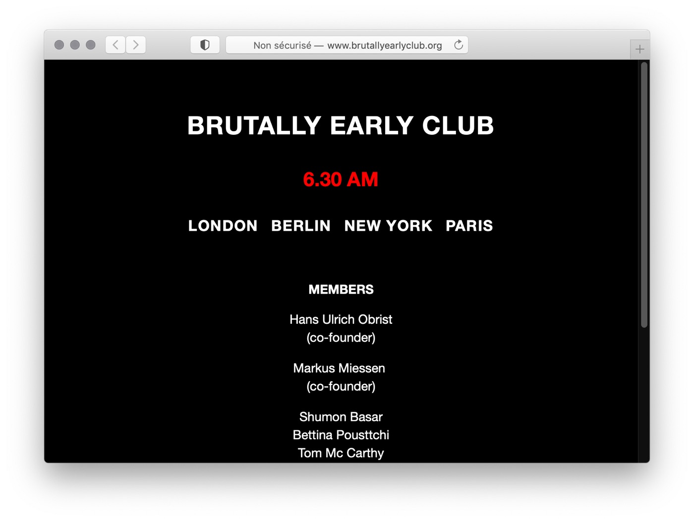
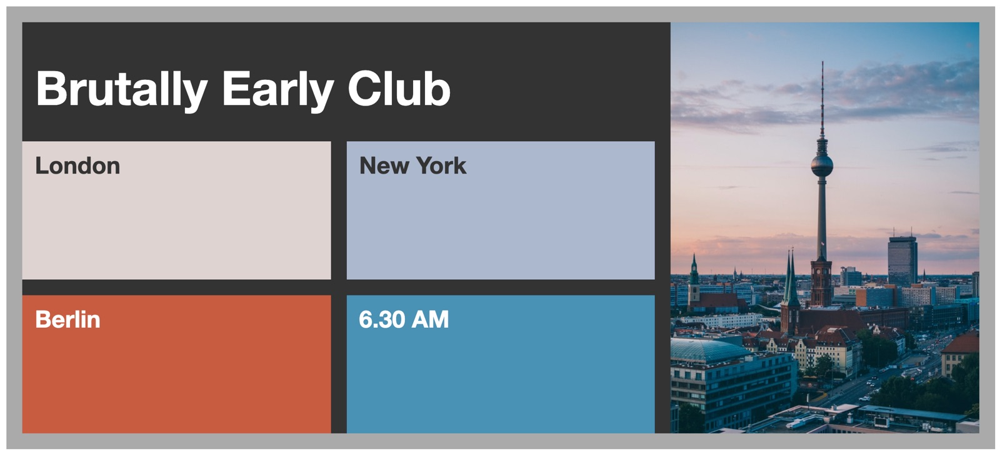

Le cours du 14 septembre était consacré au module CSS Grid Layout. 

Le support d'apprentissage se trouve dans ce site dédié : 

[https://cours-web.ch/css-grid/](https://cours-web.ch/css-grid/)

Les éléments à retenir:

- Le concept des **Grid Container** (l'élément parent, le contenenur de la grille) et **Grid Item** (le ou les enfants directs d'un Grid Container, formant le "contenu" qui sera placé sur la grille).

### Terminologie:

Voici les termes à connaître, les éléments logiques qui constituent une grille:

- **Grid Line** : une ligne virtuelle, horizontale ou verticale, divisant la grille. Chaque ligne a un numéro, qui servira à placer les Grid Items.
- **Grid Track** : une piste, horizontale (row), ou verticale (column).
- **Grid Cell** : une cellule, une intersection entre deux pistes. La plus petite entité de positionnement.
- **Grid Area** : emplacement constitué d'une ou plusieurs *Grid Cell*, dans lequel se positionne un *Grid Item*.

- [Initialisation de la grille](https://cours-web.ch/css-grid/initialisation.html)
- L'unité fr
- [Placer des éléments sur la grille](https://cours-web.ch/css-grid/grid-items.html)
- [Gouttières](https://cours-web.ch/css-grid/gouttieres.html)

## Le challenge No 3

Le challenge du 14 septembre consiste à produire un design utilisant CSS Grid Layout, pour le "Brutally Early Club".

Le "Brutally Early Club" est un projet fondé par le curateur d'art contemporain Hans-Ulrich Obrist. C'est un "salon de discussion" pour personnes à l'horaire chargé, se déroulant à 6:30 du matin. Voici le site web original: [http://www.brutallyearlyclub.org/](http://www.brutallyearlyclub.org/).

Et voici le design qu'on aimerait obtenir, en utilisant CSS Grid Layout:

Pour vous aider à démarrer, et vous concentrer sur les propriétés du Grid Layout, vous pouvez utiliser ce code:
[https://codepen.io/eracom/pen/zYzdNYV?editors=1100](https://codepen.io/eracom/pen/zYzdNYV?editors=1100)

Une fois le travail terminé, transmettez votre code via le devoir dans Teams. Vous pouvez le publier sur Codepen, Netlify, ou Replit, selon votre préférence.

## Tutoriels, ressources en ligne:

Ressources d'apprentissage:

- [Support de cours Grid Layout](https://cours-web.ch/css-grid/)
- [A Complete Guide to Grid](https://css-tricks.com/snippets/css/complete-guide-grid/), par CSS-Tricks
- [Traduction en français](https://la-cascade.io/css-grid-layout-guide-complet/) (mais il manque les visuels)
- [CSS Grid Layout](https://www.alsacreations.com/article/lire/1388-CSS3-Grid-Layout.html) expliqué par Raphaël Goetter
- [CSS Grid Layout sur MDN](https://developer.mozilla.org/fr/docs/Web/CSS/CSS_Grid_Layout/Basic_Concepts_of_Grid_Layout)

Ressources techniques:

- [La spécification du W3C](https://www.w3.org/TR/css-grid-1/)
- [Grid by Example](https://gridbyexample.com/examples/), collection d'exemples par Rachel Andrews.
