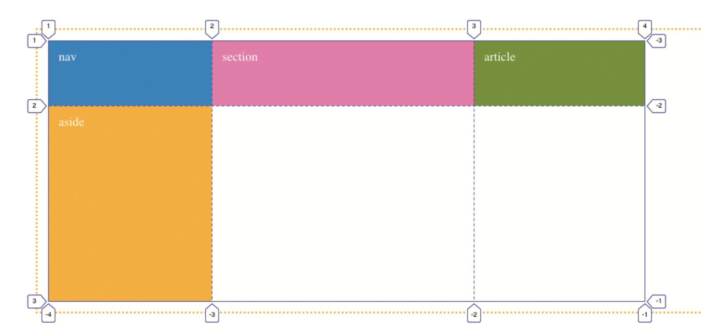

L'arrivée de la mise en page par grilles dans les navigateurs est une longue histoire. C'est au printemps 2017 que le module CSS Grid Layout devient réalité et peut être exploité en production. 

Dans cette courte vidéo, *Creating CSS Grid*, les équipes de Igalia, Microsoft et d’autres développeurs du projet Grid Layout relatent la naissance et les débuts de cette spécification :
[https://www.youtube.com/watch?v=J9uaT9dggZE](https://www.youtube.com/watch?v=J9uaT9dggZE)

## Ok, mais comment ça marche ?

Les grilles CSS sont constituées de deux entités:

- **Grid Container** : l'élément parent, le contenenur de la grille. Pour que la grille existe, il faut la déclarer sur un élément qui sera le parent.
- **Grid Item** : le ou les enfants directs d'un Grid Container. Ces éléments forment le "contenu" qui sera placé sur la grille.


### Terminologie:

Voici les termes à connaître, les éléments logiques qui constituent une grille:

- **Grid Line** : une ligne virtuelle, horizontale ou verticale, divisant la grille. Chaque ligne a un numéro, qui servira à placer les Grid Items.
- **Grid Track** : une piste, horizontale (row), ou verticale (column).
- **Grid Cell** : une cellule, une intersection entre deux pistes. La plus petite entité de positionnement.
- **Grid Area** : emplacement constitué d'une ou plusieurs *Grid Cell*, dans lequel se positionne un *Grid Item*.


## Initialisation de la grille

Voici comment déclarer une grille CSS:

```css
.container {
  display: grid;
}
```

Avec la propriété `display: grid`, on définit le conteneur. Pour que la grille fonctionne visuellement, il faut aussi spécifier les colonnes et rangées.

### Déclarations des colonnes et rangées

Les trois propriétés suivantes permettent différentes manières de définir des colonnes ou rangées:

- `grid-template-rows` : spécifie le nombre et la hauteur des rangées (rows)
- `grid-template-columns` : spéficie le nombre et la largeur des colonnes.
- `grid-template-areas` : permet d'associer un nom aux zones de la grille.

Exemple: pour déclarer deux colonnes de largeur égale, on peut procéder ainsi:

```css
.container {
  display: grid;
  grid-template-columns: 50% 50%;
}
```

#### L'unité fr

On peut aussi utiliser une nouvelle unité CSS, conçue spécialement pour faciliter la conception de grilles: l'unité `fr`, qui signifie "fraction". Cette unité désigne une fraction de l'espace disponible.

Ainsi, si on écrit:

```css
.container {
  display: grid;
  grid-template-columns: 200px 1fr;
}
```

La première colonne aura une largeur de 200 pixels. La seconde colonne occupera tout l'espace restant.

Si on veut créer une grille de 4 colonnes, avec ces proportions: 25% 25% 25% 25%. On pourra écrire: `grid-template-columns: 1fr 1fr 1fr 1fr;`

### Placer des éléments sur la grille

Une fois la grille déclarée, les éléments enfants (les *Grid Items*) vont se placer automatiquement dans l'ordre des cellules disponibles.

Si on veut définir des positions autres que la répartition automatique, on peut utiliser ces propriétés de placement: 

- `grid-column-start`
- `grid-column-end`
- `grid-row-start`
- `grid-row-end`
- `order`

Pour cela, il est important de comprendre comment fonctionnent les *Grid Lines*. Comme vous voyez sur cette image, chaque ligne possède un numéro:



Si on veut positionner un élément entre les lignes verticales 2 et 3, on écrira:

```css
section {
  grid-column-start: 2;
  grid-column-end: 3;
}
```

[Voici un codepen](https://codepen.io/eracom/pen/abwyybp) avec un exemple simple qui vous permet de vous exercer.


### Gouttières

Les propriétés suivantes permettent de créer une gouttière, un espace séparant les *Grid Tracks*.

- `row-gap` : espacement horizontal entre chaque rangée.
- `column-gap` : espacement vertical entre chaque colonne.
- `gap` : racourci pour les deux.


## Le challenge No 3

Le challenge d'aujourd'hui consiste à produire un design utilisant CSS Grid Layout, pour le "Brutally Early Club".

Le "Brutally Early Club" est un projet fondé par le curateur d'art contemporain Hans-Ulrich Obrist. C'est un "salon de discussion" pour personnes à l'horaire chargé, se déroulant à 6:30 du matin. Voici le site web original: [http://www.brutallyearlyclub.org/](http://www.brutallyearlyclub.org/).


Et voici le design qu'on aimerait obtenir, en utilisant CSS Grid Layout:


Pour vous aider à démarrer, et vous concentrer sur les propriétés du Grid Layout, vous pouvez utiliser ce code:
[https://codepen.io/eracom/pen/zYzdNYV?editors=1100](https://codepen.io/eracom/pen/zYzdNYV?editors=1100)

Une fois le travail terminé, transmettez votre code via le devoir dans Teams. Vous pouvez le publier sur Codepen, Netlify, ou Replit, selon votre préférence.

## Tutoriels, ressources en ligne:

Ressources d'apprentissage:

- [A Complete Guide to Grid](https://css-tricks.com/snippets/css/complete-guide-grid/), par CSS-Tricks
- [Traduction en français](https://la-cascade.io/css-grid-layout-guide-complet/) (mais il manque les visuels)
- [CSS Grid Layout](https://www.alsacreations.com/article/lire/1388-CSS3-Grid-Layout.html) expliqué par Raphaël Goetter
- [CSS Grid Layout sur MDN](https://developer.mozilla.org/fr/docs/Web/CSS/CSS_Grid_Layout/Basic_Concepts_of_Grid_Layout)

Ressources techniques:

- [La spécification du W3C](https://www.w3.org/TR/css-grid-1/)
- [Grid by Example](https://gridbyexample.com/examples/), collection d'exemples par Rachel Andrews.
