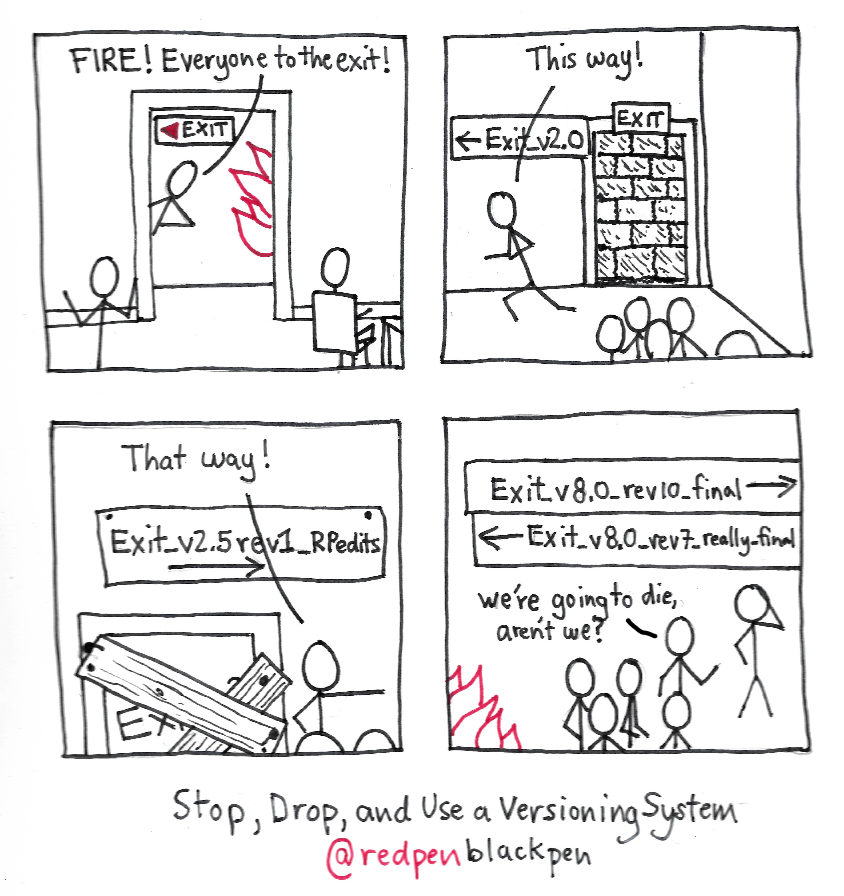

**7 décembre 2021:** Premier volet du cours sur GIT.

Courte séquence d’introduction du sujet. “Qu’est-ce que GIT, d’où ça vient, à quoi ça sert”...

## Liens utiles: 

- Support de cours dédié à GIT: [https://cours-web.ch/git/](https://cours-web.ch/git/)

Une vidéo d'introduction sympathique: *Débuter avec Git et Github en 30 min*

<iframe width="560" height="315" src="https://www.youtube.com/embed/hPfgekYUKgk" title="YouTube video player" frameborder="0" allow="accelerometer; autoplay; clipboard-write; encrypted-media; gyroscope; picture-in-picture" allowfullscreen></iframe>

## Questions fondamentales Git

### Qu'est-ce que Git ?

Git est un logiciel de gestion de versions décentralisé. C'est un puissant outil de collaboration, indispensable dans tous les types de projets informatiques.

### D'ou vient GIT

Git a été créé en 2005 par Linus Torvalds (le créateur de Linux).

### Que signifie le mot Git ?

Selon Wikipédia: « quand on lui a demandé pourquoi il avait appelé son logiciel “git”, qui est à peu près l'équivalent de “connard” en argot britannique, Linus Torvalds a répondu “je ne suis qu'un sale égocentrique, donc j'appelle tous mes projets d'après ma propre personne. D'abord Linux, puis Git.” ».

### À quoi sert Git ?

- Permet de synchroniser un projet entre plusieurs collaborateurs.
- Offre un historique précis de toutes les modifications d'un projet.

---

## Exemples de ce que Git permet d'éviter

Quand on s'échange par email les versions successives d'un document Word...

Voilà ce que ça donnerait si on nommait ainsi les issues de secours:

C'est pour éviter ces problèmes qu'on a inventé les logiciels de gestion de versions.

## Comment fonctionne Git ?

Git est un logiciel pouvant fonctionner en ligne de commande, on lui "parle" en utilisant des commandes, telles que `pull`, `push`, `clone`, `add`, `commit`...

Le principe: 

1. En utilisant des commandes Git, on enregistre des "snapshots" qui conservent l'état du projet à un point précis.
2. On synchronise les modifications locales avec un serveur distant. Git s'occupe de fusionner les modifications.

### Quelques commandes

git commit

<video width="640" height="360" controls>
  <source src="video/clamp-demo.mp4" type="video/mp4">
</video>