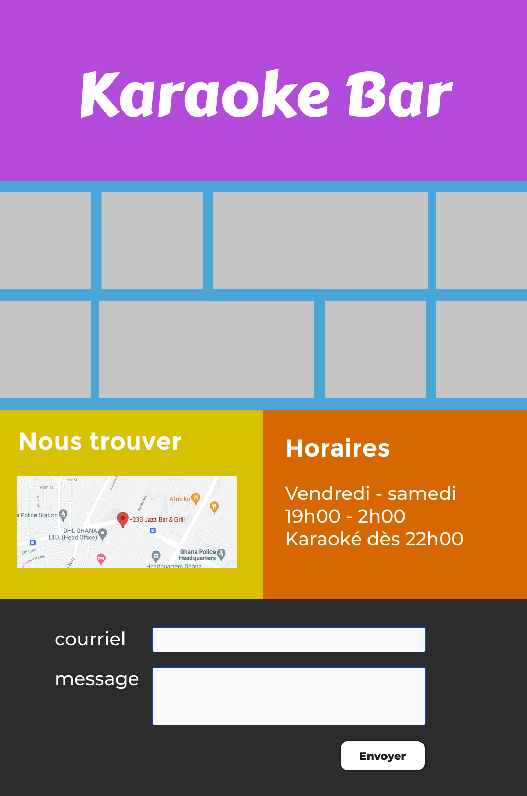
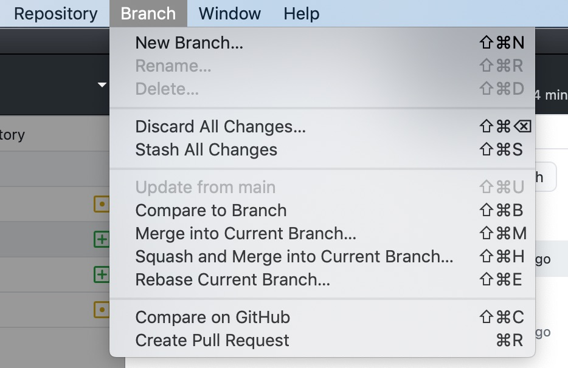

**21 décembre 2021:** Troisième volet du cours sur GIT.

## Exercice à réaliser

Ce 3e cours propose un exercice concret: concevoir une page web *one-page* pour un Karaoke Bar.

L'objectif est de concevoir un site selon ce modèle:

[https://www.figma.com/file/AEFrANdpZT5oGqeGymIowG/Karaoke-Bar?node-id=0%3A1](https://www.figma.com/file/AEFrANdpZT5oGqeGymIowG/Karaoke-Bar?node-id=0%3A1)

Ce travail se fait par équipes (de 2 à 4 élèves), afin de pouvoir mieux appliquer un *workflow*.

## Méthodologie Git pour projets de design

- Créez une nouvelle branche quand vous commencez à travailler sur une nouvelle fonctionnalité.
- Travaillez normalement, enregistrez les fichiers.
- Faites un **Commit** de vos modifications (avec un message les décrivant).
- Faites un **Push** de vos modifications (vers Github).
- Faites un **Pull Request** de votre branche vers la branche principale (“main”).

La gestion des branches et des Pull Request est accessible par le menu *Branch*:

## Les critères qui seront évalués

- messages de commit pertinents (2pts)
- quantité de commits pertinente, pour chaque élève impliqué (2pts)
- bien nommer les fichiers (2pts)
- utiliser les branches (2pts)
- définir les rôles dans l’équipe, s’attribuer des tâches (= *feature branches*) (2pts)
- utiliser les pull request (quand une branche est fusionnée avec la branche principale) (2pts)
- utiliser le readme (2pts)
- utiliser le gitignore (2pts)
- créer un meme humoristique au sujet de Git (point bonus)
- gérer un conflit de fusion (point bonus)

### Barème

| Points obtenus      | Note |
|:------------------- |:---- |
| 16 ou +             | 6    |
| 14-15               | 5,5  |
| 12-13               | 5    |
| 11                  | 4,5  |
| 9-10                | 4    |
| 8                   | 3,5  |
| 6-7                 | 3    |