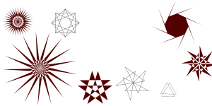

# Le format SVG 

SVG est un format d'images vectorielles. Les images vectorielles peuvent être redimensionnées sans perte de qualité.

SVG est une norme développée par le World Wide Web Consortium (W3C) depuis 1999. Il est explicitement conçu pour fonctionner avec d'autres standards du W3C comme CSS.

Exemple de SVG venant de [https://iconsvg.xyz/](https://iconsvg.xyz/) :

```html
<svg width="100" height="100" viewBox="0 0 24 24" fill="none" stroke="#9013fe" stroke-width="2" stroke-linecap="round"
    stroke-linejoin="round">
  <line x1="18" y1="6" x2="6" y2="18" />
  <line x1="6" y1="6" x2="18" y2="18" />
</svg>
```

Le résultat: 

<svg width="100" height="100" viewBox="0 0 24 24" fill="none" stroke="#9013fe" stroke-width="2" stroke-linecap="round"
    stroke-linejoin="round">
  <line x1="18" y1="6" x2="6" y2="18" />
  <line x1="6" y1="6" x2="18" y2="18" />
</svg>

## Vocabulaire du SVG

Un peu comme le HTML, le format SVG comporte toute une série de "balises". Il en existe plusieurs dizaines ([voir la liste](https://developer.mozilla.org/fr/docs/Web/SVG/Element)).

### Formes basiques

Voici quelques balises qui permettent de représenter des formes basiques: 

- les rectangles : `<rect/>`
- les cercles  et les ellipses : `<circle/>` et `<ellipse/>`
- les lignes : `<line/>`
- les polygones : `<polygon/>`

Chacun de ces éléments possède des attributs nécessaires pour le positionnement.

**Les rectangles** : on utilise la balise `<rect>` qui a quatre attributs: 

- `x` et `y` pour la position d'origine.
- `width` qui  donne la longueur.
- `height` qui donne la hauteur.

Exemple: `<rect x="10" y="10" width="80" height="50"/>`

Résultat:

<svg width="100" height="100" viewBox="0 0 100 100" fill="none" stroke="blue" stroke-width="4">
  <rect x="10" y="10" width="80" height="50"/>
</svg>

**Les cercles** : on utilise la balise `<circle>` qui a trois attributs: 

- `cx` et `cy` donne la position du centre du cercle.
- `r` est le rayon.

Exemple: `<circle cx="50" cy="50" r="50"/>`

Résultat:

<svg width="100" height="100" viewBox="0 0 100 100" fill="none" stroke="blue" stroke-width="10">
  <circle cx="50" cy="50" r="40"/>
</svg>

### Propriétés CSS

Les éléments SVG ont des propriétés CSS particulières, voici quelques-unes des plus importantes: `fill`, `stroke` et `stroke-width`.

- `fill` donne la valeur de remplissage, c’est à dire la couleur dont sera peint notre objet.
- `stroke` est la couleur de la bordure de notre objet.
- `stroke-width` est la taille de cette bordure.

En dehors des propriétés spécifiques au SVG, les règles habituelles du CSS s'appliquent, y compris les animations, transitions, transforms, filters...

## Ressources pour travailler avec les SVG

### Collections d'icônes

Quelques collections d'icônes en SVG:

- [ICONSVG](https://iconsvg.xyz/)
- [http://svgicons.sparkk.fr/](http://svgicons.sparkk.fr/)
- [Feather Icons](https://feathericons.com/)
- [Super Tiny Icons](https://github.com/edent/SuperTinyIcons) - icônes de moins de 1kb.
- [The Noun Project](https://thenounproject.com/)
- [Spark Joy](https://github.com/sw-yx/spark-joy/blob/master/README.md#general--misc) - une liste de sites-ressources
- [Un fil twitter récent](https://twitter.com/argyleink/status/1480237318971686918) qui liste des "favorite open source icon libraries"

### Créer ou modifier des SVG

Comme le SVG est un format libre, il existe un grand nombre d'outils pour les créer et modifier:

- Illustrator, Sketch, Figma : tous ces éditeurs vectoriels peuvent exporter des SVG.
- [Inkscape](https://inkscape.org/fr/) est un logiciel de dessin vectoriel open source dont le format natif est le SVG.

Il existe de nombreux éditeurs en ligne: 

- [Boxy SVG](https://boxy-svg.com/)
- [Method Draw](https://editor.method.ac/)
- [SvgPathEditor](https://yqnn.github.io/svg-path-editor/)
- [Graphite](https://editor.graphite.design/)
- [SVGEdit](https://svgedit.netlify.app/editor/)
- [PolyPal](https://flukeout.github.io/PolyPal/) "web-based SVG editor for low-poly style illustrations"...




### Guides et documentation

- [Documentation SVG dans MDN](https://developer.mozilla.org/fr/docs/Web/SVG)
- [Page de ressources du W3C](https://www.w3.org/Graphics/SVG/)
- Un petit guide sur CSS Tricks: [SVG Properties and CSS](https://css-tricks.com/svg-properties-and-css/)
